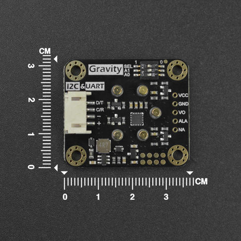

# DFRobot_MultiGasSensor
- [中文版](./README_CN.md)

Gas sensors are widely applied to many fields such as gas research, environmental detection, production safety monitoring, dissolved gas analysis, pollution source/outlet law research, detection of toxic and harmful and combustible gas, laboratory or on-site simple gas analysis and testing, etc. This Multi-gas Sensor can be used with a variety of gas probes to detect hazardous gas concentration.


## Product Link(https://www.dfrobot.com/)

SKU：DFR0784

## Table of Contents

* [Summary](#summary)
* [Installation](#installation)
* [Methods](#methods)
* [Compatibility](#compatibility)
* [History](#history)
* [Credits](#credits)

## Summary

This Gas Sensor can be used in complex environments to detect different gas like O2, CO, H2S,
NO2, O3, CL2, NH3, H2, HCL, SO2, HF and PH3, which is achieved by just switching corresponding probes.
Meanwihle, it supports gas high/low threshold alarm.

## Installation

To use this library download the zip file, uncompress it to a folder named DFRobot_MultiGasSensor.
Download the zip file first to use this library and uncompress it to a folder named DFRobot_MultiGasSensor.

## Methods

```python
  '''!
    @brief Parse data returning from sensor
    @param recv The obtained data
  '''
  def analysis_all_data(self,recv):

  '''
  @brief Change the mode of reporting data to the main controller after the sensor has collected the gas.
  @param INITIATIVE: The sensor proactively reports data
         PASSIVITY : The sensor can report data only after the main controller sends request to it.
  @return status
          True is :  change success
          False is:  change fail
  '''
  def change_acquire_mode(self,mode):

  '''
    @brief Get the gas concentration or type obtained by the sensor
    @param gastype    : The current sensor type
         O2 : oxygen
         CO : carbonic oxide
         H2S: hydrogen sulfide
         NO2: nitrogen dioxide
         O3 : ozone
         CL2: chlorine
         NH3: ammonia
         H2 : hydrogen
         HF : hydrogen fluoride
         PH3: phosphine
    @return If data is transmitted normally, return gas concentration
      Otherwise, return 0xffff
  '''
  def read_gas_concentration(self):

  '''
    @brief Change the mode of reporting data to the main controller after the sensor has collected the gas.
    @param INITIATIVE: The sensor proactively reports data
         PASSIVITY : The sensor can report data only after the main controller sends request to it.
    @return status
          True is ： change success
          False is： change fail
  '''
  def change_acquire_mode(self,mode):

  '''
    @brief Get the gas concentration or type obtained by the sensor
    @param gastype    : The current sensor type
         O2 : oxygen
         CO : carbonic oxide
         H2S: hydrogen sulfide
         NO2: nitrogen dioxide
         O3 : ozone
         CL2: chlorine
         NH3: ammonia
         H2 : hydrogen
         HF : hydrogen fluoride
         PH3: phosphine
    @return If data is transmitted normally, return gas concentration
      Otherwise, return 0xffff
  '''
  def read_gas_concentration(self):      

  '''
    @brief Get the gas type obtained by the sensor
    @param No
    @return Gas type
        O2   0x05
        CO   0x04
        H2S  0x03
        NO2  0x2C
        O3   0x2A
        CL2  0x31
        NH3  0x02
        H2   0x06
        HCL  0X2E
        SO2  0X2B
        HF   0x33
        PH3  0x45
  '''
  def read_gas_type(self):  

  '''
    @brief Set sensor alarm threshold
    @param switchof    : Set whether to turn on alarm function
           ON          : Turn on alarm function
           OFF         : Turn off alarm function
           threshold   : Set alarm threshold
           returntype : 
           GASCON     : Gas concentration
    @return status  : init status
            True is : init success
            False is: init error
  '''
  def set_threshold_alarm(self,switchof,threshold,gasType):    

  '''
    @brief Get sensor onboard temperature
    @param No
    @return Return the current board temperature as float type
  '''
  def read_temp(self):    

  '''
    @brief Set whether to turn on temperature compensation, values output by sensor under different temperatures are various.
          To get more accurate gas concentration, temperature compensation are necessary when calculating gas concentration.
    @param tempswitch：
          ON          : Turn on temperature compensation
          OFF         : Turn off temperature compensation
    @return 无
  '''
  def set_temp_compensation(self,tempswitch):      

  '''
    @brief Set whether to turn on temperature compensation, values output by sensor under different temperatures are various.
          To get more accurate gas concentration, temperature compensation are necessary when calculating gas concentration.
    @param tempswitch：
          ON          : Turn on temperature compensation
          OFF         : Turn off temperature compensation
    @return 无
  '''
  def set_temp_compensation(self,tempswitch):

  '''
    @brief Get sensor gas concentration output by original voltage, which is different from reading sensor register directly.
          The function is mainly for detecting whether the read gas concentration is right.
    @param  vopin：Pin for receiving the original voltage output from sensor probe
    @return The original voltage output of sensor gas concentration
  '''
  def read_volatage_data(self): 
        
```
## Compatibility

| Mainboard         | Pass | Miss | No Test | Note |
| ------------ | :--: | :----: | :----: | :--: |
| RaspberryPi2 |      |        |   √    |      |
| RaspberryPi3 |      |        |   √    |      |
| RaspberryPi4 |  √   |        |        |      |

* Python Version

| Python  | Pass | Miss | No Test | Note |
| ------- | :--: | :----: | :----: | ---- |
| Python2 |  √   |        |        |      |
| Python3 |  √   |        |        |      |

## History

- 02,04, 2021 - Version 2.0 released.

## Credits

Written by PengKaixing(kaixing.peng@dfrobot.com), 2021. (Welcome to our [website](https://www.dfrobot.com/))
